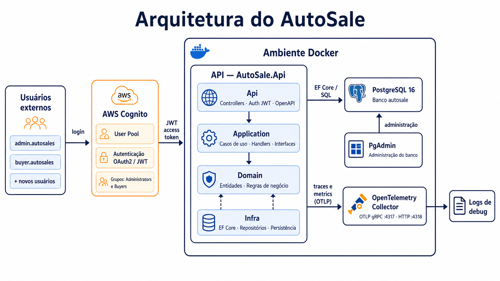
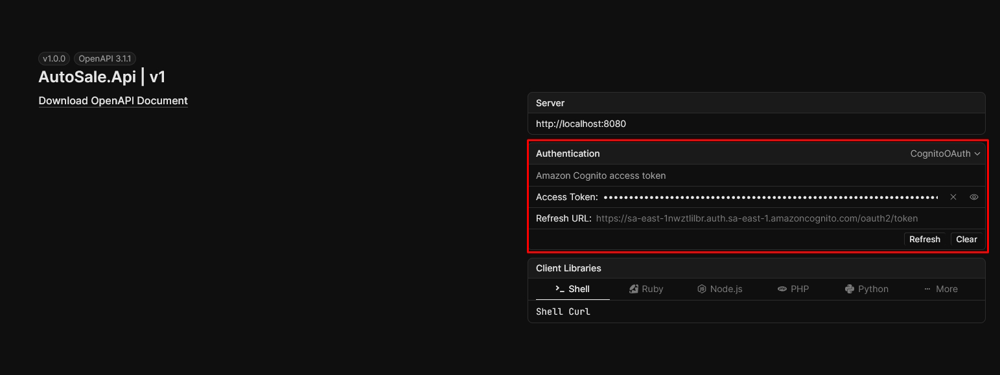

# FIAP Auto Sales API

API REST para a plataforma de revenda de veículos do Tech Challenge da FIAP (SOAT Fase 3 Prova Substitutiva). A solução permite que administradores cadastrem e atualizem veículos e que compradores previamente cadastrados no Amazon Cognito consultem o catálogo e finalizem uma compra de forma segura.

## Índice

- [Sobre o projeto](#sobre-o-projeto)
- [Funcionalidades](#funcionalidades)
- [Tecnologias e arquitetura](#tecnologias-e-arquitetura)
- [Estrutura da aplicação](#estrutura-da-aplicação)
- [Execução local](#execução-local)
- [Documentação e autenticação no Scalar](#documentação-e-autenticação-no-scalar)
- [Endpoints principais](#endpoints-principais)
- [Fluxo de compra](#fluxo-de-compra)
- [Estratégia de autenticação](#estratégia-de-autenticação)
- [Modelagem do banco](#modelagem-do-banco)
- [Testes](#testes)
- [CI/CD](#cicd)
- [Observabilidade e operação](#observabilidade-e-operação)
- [Limites do escopo](#limites-do-escopo)

## Sobre o projeto

Uma revenda de veículos precisa disponibilizar seu catálogo na internet e permitir que clientes já cadastrados efetuem compras. O desafio exige preservar a separação entre dados de identidade e dados transacionais, evitar a venda duplicada de um mesmo veículo e disponibilizar uma entrega reproduzível por CI/CD.

A FIAP Auto Sales API resolve esse cenário como um monólito modular. O Amazon Cognito é responsável pelo cadastro, confirmação e autenticação dos usuários; a aplicação não armazena senhas, CPF, nome ou e-mail de compradores. O PostgreSQL mantém apenas os veículos, as vendas e o identificador opaco (`sub`) de quem comprou.

## Funcionalidades

| Área | Funcionalidade | Como funciona |
| --- | --- | --- |
| Veículos | Cadastro | Usuários do grupo Cognito `admins` criam veículos com marca, modelo, ano, cor e preço. |
| Veículos | Edição | Administradores atualizam os dados enquanto o veículo estiver disponível. Veículos vendidos não podem ser alterados. |
| Veículos | Catálogo disponível | Qualquer pessoa pode consultar veículos disponíveis, com paginação e ordenação por preço crescente. |
| Compras | Compra autenticada | Um usuário autenticado compra um veículo disponível; a venda registra o preço praticado e o `sub` do comprador. |
| Compras | Catálogo de vendidos | Qualquer pessoa pode consultar as vendas, também em ordem crescente de preço e com paginação. |
| Consistência | Proteção contra duplicidade | A compra usa transação, bloqueio da linha do veículo (`FOR UPDATE`) e restrições únicas no banco para que apenas uma compra seja efetivada. |
| Autenticação | OIDC/JWT | A API valida *access tokens* emitidos pelo Cognito. Operações administrativas exigem o grupo `admins`. |

## Tecnologias e arquitetura

- .NET 10 e ASP.NET Core Web API
- Entity Framework Core 10 e Npgsql
- PostgreSQL 16
- Amazon Cognito (OIDC/OAuth 2.0 e JWT)
- Scalar e OpenAPI para documentação interativa
- Docker e Docker Compose
- OpenTelemetry e OpenTelemetry Collector
- xUnit para testes unitários e de arquitetura
- GitHub Actions para integração contínua, build da imagem e validação do ambiente Docker

### Arquitetura

O projeto adota Clean Architecture em um monólito modular: as regras de negócio ficam no centro e não dependem de HTTP, banco de dados ou Cognito. As dependências apontam sempre para dentro; essa regra é coberta pelos testes de arquitetura.



| Camada | Responsabilidade |
| --- | --- |
| **Domain** | Entidades `Vehicle` e `Sale`, seus estados e invariantes: preço positivo, ano válido, veículo vendido não é editável nem vendido novamente. Não depende de frameworks. |
| **Application** | Casos de uso, DTOs e contratos (portas) de repositórios, relógio, usuário atual e unidade de trabalho. Orquestra cadastro, edição, listagens e compra. |
| **Infra** | Implementações técnicas das portas: EF Core/Npgsql, repositórios PostgreSQL, migrations, transações e relógio do sistema. |
| **SharedKernel** | Tipos mínimos reutilizáveis e independentes, como `Entity`, `Result`, `Error` e `ErrorType`. |
| **API** | Controllers REST, contratos HTTP, tratamento de erros com `ProblemDetails`, composição de dependências, OpenAPI/Scalar, autenticação e autorização. |

## Estrutura da aplicação

```text
AutoSale/
├── .github/workflows/ci.yml              # Pipeline do GitHub Actions
├── docs/
│   ├── architecture/autosale-architecture.png
│   └── spec/                              # Enunciado e planejamento do Tech Challenge
├── src/
│   ├── AutoSale.Api/                      # HTTP, Scalar, JWT e policies
│   │   ├── Authentication/
│   │   ├── Authorization/
│   │   ├── Controllers/
│   │   ├── Contracts/
│   │   └── Program.cs
│   ├── AutoSale.Application/              # Casos de uso e abstrações
│   │   ├── Abstractions/
│   │   ├── Sales/
│   │   └── Vehicles/
│   ├── AutoSale.Domain/                   # Regras e entidades de negócio
│   │   ├── Sales/
│   │   └── Vehicles/
│   ├── AutoSale.Infrastructure/           # EF Core, PostgreSQL e migrations
│   │   └── Persistence/
│   └── BuildingBlocks/AutoSale.SharedKernel/
├── tests/
│   ├── AutoSale.Domain.UnitTests/
│   ├── AutoSale.Application.UnitTests/
│   ├── AutoSale.ArchitectureTests/
│   └── AutoSale.Api.IntegrationTests/
├── docker-compose.yml
├── otel-collector-config.yaml
└── AutoSale.slnx
```

## Execução local

### Usuários de teste no Cognito
| Usuário | Senha | Grupo | Observações |
| --- | --- | --- | --- |
| `admin.autosale` | `!Fiap2026` | `admins` | Usuário administrador de teste |
| `buyer.autosale` | `!Fiap2` | -- | Usuário comprador de teste. Outros usuários cadastrados se classificam como compradores. |

### Pré-requisitos

- [Git](https://git-scm.com/)
- [Docker Desktop](https://www.docker.com/products/docker-desktop/) em execução, com Docker Compose v2
- Opcional para executar os testes fora do container: SDK do .NET 10
- Uma conta de comprador confirmada no Cognito para testar a compra e uma conta no grupo `admins` para cadastrar ou editar veículos

### Subir o ambiente

Na raiz do repositório, execute:

```powershell
git clone https://github.com/ARC-373/FIAP-AutoSale.git
Set-Location FIAP-AutoSale
docker compose up --build -d
```

O arquivo `.env` já contém as configurações locais de portas e as configurações públicas do Cognito.

O Compose inicia os seguintes serviços:

| Serviço | Endereço local | Finalidade |
| --- | --- | --- |
| API | <http://localhost:8080> | API REST, Scalar e health check. |
| PostgreSQL | `localhost:5432` | Persistência transacional. |
| pgAdmin | <http://localhost:5050> | Inspeção local opcional do banco. |
| OpenTelemetry Collector | `localhost:4317` (gRPC) / `4318` (HTTP) | Recebe traces e métricas da API. |

As migrations do EF Core são aplicadas automaticamente na inicialização do container da API. Confirme a disponibilidade com:

```powershell
Invoke-WebRequest http://localhost:8080/health
```

### Encerrar ou reiniciar o ambiente

Para interromper os containers sem remover os dados do PostgreSQL e do pgAdmin:

```powershell
docker compose down
```

Para reiniciar o ambiente preservando os volumes:

```powershell
docker compose up --build -d
```

Para descartar também os dados locais e recomeçar do zero (ação destrutiva):

```powershell
docker compose down --volumes --remove-orphans
```

## Documentação e autenticação no Scalar

Com o ambiente em execução, abra <http://localhost:8080/docs/>. A UI do Scalar expõe o OpenAPI da API e o esquema OAuth `CognitoOAuth`.

### Login pelo Cognito no Scalar

1. No Scalar, abra **Authentication** e selecione `CognitoOAuth`.
2. Clique em **Authorize** e conclua o login na Hosted UI do Cognito.
3. O fluxo Authorization Code usa PKCE e solicita os escopos `openid`, `profile` e `email`.
4. Após a autorização, execute o endpoint desejado. Para criar/editar, o usuário autenticado deve pertencer ao grupo `admins` no Cognito.

> **Evidência da autenticação no Scalar**




### Alternativa: obter um token no PowerShell

Obtenha um *access token* com a AWS CLI instalada e configurada:

```powershell
$clientId = '3kmefe75etgo71ffeblpqbjpn5'
$username = Read-Host 'Usuário Cognito'
$securePassword = Read-Host 'Senha Cognito' -AsSecureString
$password = [System.Net.NetworkCredential]::new('', $securePassword).Password

$auth = aws cognito-idp initiate-auth `
  --region sa-east-1 `
  --auth-flow USER_PASSWORD_AUTH `
  --client-id $clientId `
  --auth-parameters "USERNAME=$username,PASSWORD=$password" | ConvertFrom-Json

$accessToken = $auth.AuthenticationResult.AccessToken
$accessToken
```

No Scalar, adicione o cabeçalho `Authorization` à requisição e informe `Bearer <accessToken>`. Use o **access token**, não o `id_token`: a API valida o *claim* `token_use=access` e o `client_id` esperado. Nunca compartilhe ou versione o token gerado.

## Endpoints principais

Os retornos de erro seguem o padrão `ProblemDetails`. As listagens aceitam `page` (padrão `1`) e `pageSize` (padrão `20`, máximo `100`).

| Método e rota | Permissão | Descrição |
| --- | --- | --- |
| `POST /api/v1/vehicles` | JWT + grupo `admins` | Cadastra um veículo disponível. Retorna `201 Created`. |
| `PUT /api/v1/vehicles/{id}` | JWT + grupo `admins` | Atualiza os dados de um veículo disponível. Retorna `409 Conflict` se o veículo já foi vendido. |
| `GET /api/v1/vehicles/available` | Pública | Lista veículos disponíveis por preço crescente e, em caso de empate, por `id`. |
| `POST /api/v1/vehicles/{id}/purchase` | JWT válido | Efetiva a compra de um veículo. Aceita `Idempotency-Key` no cabeçalho ou no corpo. Retorna `409 Conflict` se já vendido. |
| `GET /api/v1/sales/sold` | Pública | Lista vendas por preço crescente e, em caso de empate, por `id`. |
| `GET /health` | Pública | Verifica a saúde da aplicação e a conectividade com o PostgreSQL. |

### Cadastrar ou atualizar veículo

Use o mesmo corpo para `POST /api/v1/vehicles` e `PUT /api/v1/vehicles/{id}`:

```json
{
  "make": "Toyota",
  "model": "Corolla XEi",
  "year": 2025,
  "color": "Prata",
  "price": 149990.00
}
```

`make` e `model` aceitam até 120 caracteres; `color`, até 50; o ano precisa estar entre 1886 e o próximo ano-calendário; e o preço deve ser positivo, com no máximo duas casas decimais.

### Efetivar compra

```http
POST /api/v1/vehicles/{id}/purchase
Authorization: Bearer <access-token>
Idempotency-Key: compra-corolla-0001
Content-Type: application/json
```

O corpo é opcional. Quando necessário, a chave de idempotência também pode ser enviada nele:

```json
{
  "idempotencyKey": "compra-corolla-0001"
}
```

## Fluxo de compra

1. O comprador se cadastra, confirma a conta e faz login no Cognito, serviço externo à API.
2. O Cognito emite um *access token* JWT. O cliente o envia em `Authorization: Bearer <token>`.
3. A API valida assinatura, emissor e os *claims* `token_use=access` e `client_id`; então obtém o `sub` do comprador.
4. O caso de uso inicia uma transação com isolamento `ReadCommitted` e bloqueia a linha do veículo com `SELECT ... FOR UPDATE`.
5. A aplicação valida a existência e disponibilidade do veículo. Um veículo já vendido resulta em `409 Conflict`; um inexistente, em `404 Not Found`.
6. É criada a venda com o preço atual como *snapshot*, data UTC, `sub` do comprador e, quando fornecida, a chave de idempotência.
7. O veículo passa para o estado `Sold`, a venda é persistida e a transação é confirmada.
8. As restrições únicas de `sales.vehicle_id` e de `(buyer_subject, idempotency_key)` fornecem uma segunda barreira de consistência no banco.

Esse fluxo garante que duas requisições concorrentes não concluam duas vendas para o mesmo veículo.

## Estratégia de autenticação

O Amazon Cognito é o provedor de identidade e fica totalmente apartado do domínio e do banco transacional da aplicação. A API utiliza JWT Bearer com a autoridade configurada por `Authentication__Authority`; não há autenticação local nem persistência de credenciais.

- **Catálogos e health check:** públicos.
- **Compra:** requer *access token* válido de usuário autenticado.
- **Cadastro e edição de veículo:** requer *access token* válido e o grupo `admins` no *claim* `cognito:groups`.
- **Rastreabilidade de venda:** somente o `sub` é salvo em `sales.buyer_subject`, sem dados pessoais identificáveis.
- **Scalar:** OAuth 2.0 Authorization Code com PKCE, para autenticar sem expor senha ao cliente da documentação.

## Modelagem do banco

O PostgreSQL possui duas tabelas transacionais, criadas por migrations do EF Core.

| Tabela | Campos relevantes | Regras e índices |
| --- | --- | --- |
| `vehicles` | `id`, `make`, `model`, `year`, `color`, `price`, `status`, timestamps UTC e `version` | `price > 0`; índice `(status, price, id)` para a listagem de disponíveis; `version` é token de concorrência. |
| `sales` | `id`, `vehicle_id`, `buyer_subject`, `sale_price`, `purchased_at_utc`, `idempotency_key` | FK para `vehicles`; `vehicle_id` único, garantindo uma venda por veículo; `sale_price > 0`; índice `(sale_price, id)`; chave única parcial para `(buyer_subject, idempotency_key)` quando a chave foi informada. |

A relação é um para um: um veículo pode não ter venda enquanto está disponível e, após a compra, possui exatamente uma venda. As datas são armazenadas como `timestamp with time zone` em UTC e o valor vendido não muda caso o preço de catálogo seja alterado posteriormente.

## Testes

Os projetos de teste são executados por:

```powershell
dotnet test AutoSale.slnx --configuration Release
```

| Tipo | Projeto | Cobertura |
| --- | --- | --- |
| Domínio | `AutoSale.Domain.UnitTests` | Invariantes de `Vehicle`, `Sale` e dos tipos de resultado: validações, transições de estado e erros de domínio. |
| Aplicação | `AutoSale.Application.UnitTests` | Handlers de cadastro, edição, listagem e compra com *test doubles* para portas externas; inclui compra autenticada, transação e conflito por veículo vendido. |
| Arquitetura | `AutoSale.ArchitectureTests` | Impede referências das camadas internas para as externas, preservando as regras da Clean Architecture. |
| Integração | `AutoSale.Api.IntegrationTests` | Projeto preparado para validar a integração HTTP da API. |

## CI/CD

O workflow [`.github/workflows/ci.yml`](.github/workflows/ci.yml) é executado em todo Pull Request, em *push* para `master` e manualmente. Ele implementa a esteira de integração e validação de entrega em três estágios:

1. **Build and test:** faz checkout, instala .NET 10, executa `dotnet restore`, `dotnet build` em Release e `dotnet test`; os resultados TRX são publicados como artefato mesmo quando há falha.
2. **Docker build:** somente após testes aprovados, constrói a imagem da API com `docker compose build api`.
3. **Compose deploy validation:** gera configurações de CI, valida o Compose, inicializa a API, aguarda o endpoint `/health`, coleta diagnósticos e remove containers/volumes ao final.

O fluxo reforça a prática exigida pelo Tech Challenge de mudanças revisadas via Pull Request e verificadas automaticamente antes da integração. A última etapa é uma validação automatizada de implantação local via Docker Compose; a publicação em um ambiente cloud requer a configuração das credenciais e do destino de hospedagem correspondente, sem versionar segredos.

## Observabilidade e operação

A API instrumenta traces e métricas de ASP.NET Core, chamadas HTTP e runtime com OpenTelemetry. Os sinais são enviados via OTLP ao OpenTelemetry Collector definido no Compose. A identidade do serviço e o ambiente são configuráveis por variáveis como `OTEL_SERVICE_NAME`, `OTEL_RESOURCE_ATTRIBUTES` e `OTEL_EXPORTER_OTLP_ENDPOINT`.

Para diagnóstico local:

```powershell
docker compose ps
docker compose logs api
docker compose logs postgres
```

O endpoint `GET /health` verifica a aplicação e o `AutoSaleDbContext`, permitindo que o Compose e o pipeline aguardem a prontidão da API.