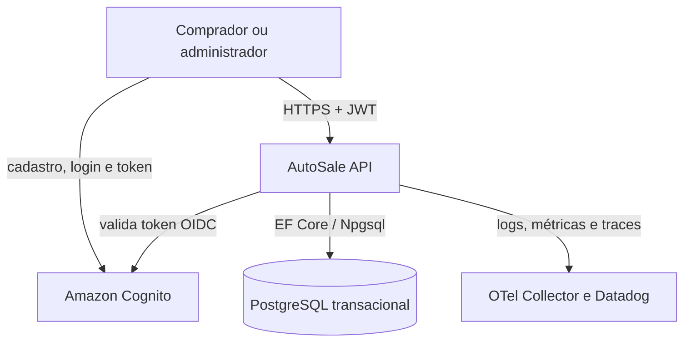
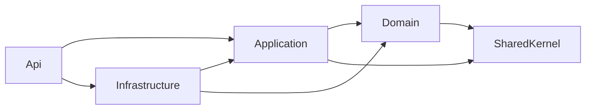
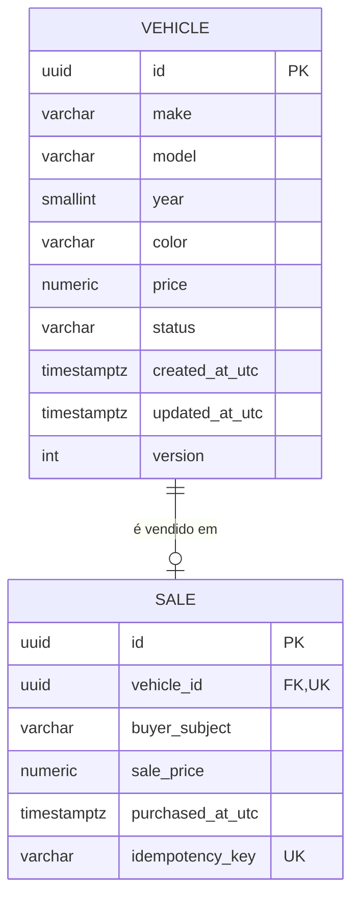
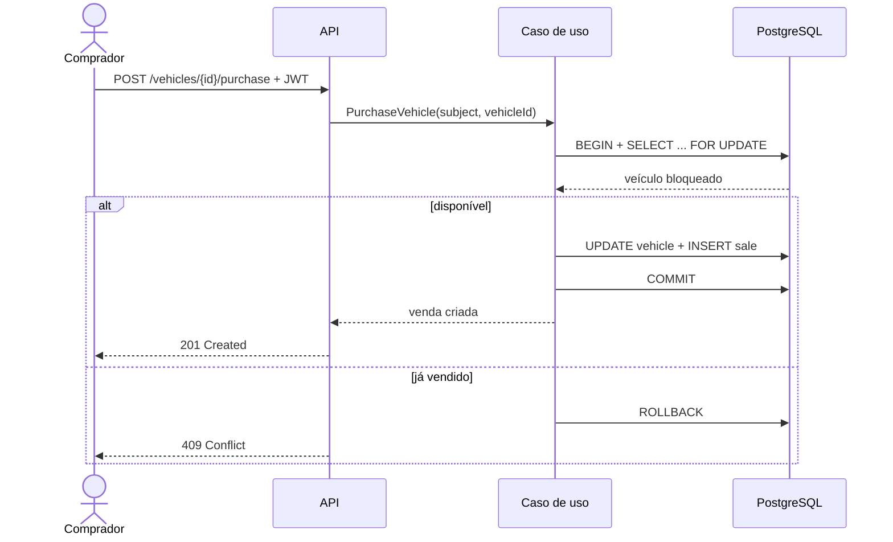

# Plano de desenvolvimento — SOAT Tech Challenge Fase 3 (Substitutiva)

> Planejamento de referência para uma entrega acadêmica em 13 dias, usando C#/.NET 10, PostgreSQL, Amazon Cognito, Clean Architecture, CI/CD e observabilidade preparada para Datadog.
>
> Fonte normativa principal: `Trabalho Sub TechChallenge SOAT - Fase 3.md`. Conteúdos acadêmicos complementares: `Fase 3 Monitoramento - Matérias e Aula.md`.
>
> Informações comerciais e limites de serviços verificadas em 17 de julho de 2026. Sempre conferir novamente antes de criar recursos pagos.

## 1. Resumo executivo

A solução recomendada é um **monólito modular em Clean Architecture**, exposto como uma única API REST e apoiado por um único banco PostgreSQL transacional. A identidade permanece totalmente fora do banco e do domínio da aplicação: o Amazon Cognito registra e autentica usuários; a API apenas valida o access token e guarda nas vendas o identificador opaco `sub` do comprador.

Essa escolha entrega os requisitos sem introduzir a sobrecarga de microserviços em um prazo de 13 dias. O sistema terá quatro projetos de produção principais (`Api`, `Application`, `Domain` e `Infrastructure`), um `SharedKernel` pequeno e projetos de testes. A compra será atômica e resistente a concorrência: duas requisições simultâneas não poderão vender o mesmo veículo.

### Prioridade da entrega

1. Fluxo funcional completo: cadastrar, editar, listar, registrar/autenticar comprador e comprar.
2. Segurança e consistência da venda.
3. Testes automatizados e pipeline por Pull Request.
4. Deploy automatizado.
5. Logs, métricas, traces, dashboard e alertas.
6. Documentação e vídeo.
7. API Gateway, idempotência avançada e refinamentos somente se os seis itens anteriores estiverem estáveis.

### Decisões recomendadas

| Tema | Decisão para a entrega | Justificativa |
|---|---|---|
| Estilo arquitetural | Monólito modular + Clean Architecture | Preserva separação interna sem custo operacional de microserviços. |
| Runtime | .NET 10 LTS | É requisito do projeto e tem suporte até novembro de 2028. |
| Persistência | EF Core + Npgsql + PostgreSQL | Implementação produtiva, migrations e testes reais com PostgreSQL. |
| Identidade | Cognito User Pool, via OIDC/JWT | Dados de identidade ficam apartados; a API não gerencia senhas. |
| Autorização | Qualquer usuário confirmado compra; grupo `admins` administra veículos | Reduz configuração de grupos e Lambda triggers sem perder controle. |
| Observabilidade | OpenTelemetry no código, OTLP Collector e Datadog como destino inicial | Evita acoplamento do código ao fornecedor e permite New Relic no futuro. |
| Gateway | Não obrigatório no MVP | Uma API única não precisa do salto adicional para cumprir o trabalho. |
| Gateway opcional | AWS HTTP API se o backend for Lambda; Kong se o deploy for container/VM | Cada gateway se encaixa melhor em uma topologia diferente. |
| Deploy inicial | Container em uma VM pequena + PostgreSQL RDS ou container, conforme orçamento | Menor risco operacional e observabilidade simples no prazo. |
| IaC | Docker Compose obrigatório; AWS SAM/Terraform apenas para o perfil AWS adotado | Evita manter duas infraestruturas incompletas. |

## 2. Escopo funcional

### 2.1 Requisitos obrigatórios extraídos do trabalho

- Cadastrar veículo para venda com marca, modelo, ano, cor e preço.
- Editar os dados do veículo.
- Permitir compra via internet somente por pessoa previamente cadastrada.
- Listar veículos à venda por preço crescente.
- Listar veículos vendidos por preço crescente.
- Manter registro/autorização de compradores totalmente separado dos dados transacionais.
- Aplicar todas as alterações por Pull Request e CI/CD.
- Disponibilizar código funcional, README, deploy automatizado, vídeo ponta a ponta e PDF final com os links.

### 2.2 Regras complementares necessárias

Os requisitos abaixo não estão escritos literalmente no enunciado, mas são necessários para uma implementação correta:

- Somente administradores cadastram ou editam veículos.
- Usuários anônimos podem consultar os catálogos; somente autenticados compram.
- Um veículo vendido não pode ser editado nem vendido novamente.
- O preço deve ser maior que zero.
- Ano deve estar em uma faixa válida definida pela aplicação.
- A compra registra um snapshot do preço efetivamente pago.
- Uma venda referencia exatamente um veículo; `sales.vehicle_id` é único.
- Listas usam um segundo critério determinístico (`id`) depois do preço.
- Datas são persistidas em UTC usando `timestamp with time zone`/`timestamptz`.
- CPF, nome, e-mail, senha e demais PII do comprador não são armazenados no banco transacional.
- O identificador do comprador é o `sub` do provedor de identidade.

### 2.3 Fora do escopo dos 13 dias

- Frontend completo.
- Pagamento real, financiamento, reserva temporária ou estorno.
- Upload e processamento de fotos.
- Exclusão de veículo.
- Notificação por e-mail/SMS.
- Microsserviços, broker de mensagens, saga e outbox.
- Multi-tenant, busca textual avançada e relatórios analíticos.
- Alta disponibilidade multi-AZ e disaster recovery de produção.

Esses itens podem aparecer no HLD como evolução futura, mas não devem consumir tempo antes dos critérios de aceite obrigatórios.

## 3. Arquitetura proposta

### 3.1 Visão de contexto



O Cognito é o sistema de registro da identidade. O PostgreSQL é o sistema de registro de veículos e vendas. A ligação entre os dois é somente o identificador opaco do sujeito autenticado.

### 3.2 Dependências entre projetos



Regras:

- `Domain` não referencia EF Core, ASP.NET, Cognito, Datadog ou configuração.
- `Application` declara portas/interfaces e orquestra casos de uso.
- `Infrastructure` implementa banco, transações, relógio e integrações externas.
- `Api` é a camada de apresentação e o composition root da aplicação.
- `SharedKernel` deve permanecer pequeno; ele não é um depósito de utilitários.
- Dependências transitivas em sentido contrário são proibidas e verificadas por teste arquitetural.

### 3.3 Modelo de implantação recomendado

Para reduzir risco, manter dois perfis claramente definidos:

**Perfil local obrigatório**

- API .NET 10 em container.
- PostgreSQL em container.
- OpenTelemetry Collector em container.
- Cognito remoto; em testes automatizados, um handler de autenticação substituto.
- Docker Compose inicia o ambiente com um comando.

**Perfil cloud recomendado para o vídeo**

- Uma VM pequena (EC2 ou Lightsail, coberta por créditos quando elegível) executando API e OTel Collector em containers.
- PostgreSQL em RDS `db.t4g.micro`/`db.t3.micro` Single-AZ, ou no mesmo Docker Compose se o objetivo for custo mínimo e a limitação estiver documentada.
- Cognito User Pool.
- Datadog como backend de observabilidade.
- GitHub Actions faz build, testes, publica imagem e atualiza o ambiente.

Não é necessário duplicar a aplicação em Lambda e container. Se a equipe optar por Lambda, deve adotar o perfil serverless por completo e registrar a decisão em ADR.

## 4. Estrutura do repositório

Nome de exemplo da solução: `AutoSale`.

```text
AutoSale/
├── .config/
│   └── dotnet-tools.json
├── .github/
│   ├── CODEOWNERS
│   ├── pull_request_template.md
│   └── workflows/
│       ├── pr-validation.yml
│       ├── deploy-development.yml
│       └── deploy-production.yml
├── docs/
│   ├── architecture/
│   │   ├── HLD.md
│   │   ├── LLD.md
│   │   ├── C4.md
│   │   ├── ERD.md
│   │   └── purchase-sequence.md
│   ├── decisions/
│   │   ├── ADR-001-monolith-clean-architecture.md
│   │   ├── ADR-002-cognito-oidc.md
│   │   ├── ADR-003-postgresql-concurrency.md
│   │   ├── ADR-004-opentelemetry-datadog.md
│   │   ├── ADR-005-api-gateway.md
│   │   └── ADR-006-deployment-model.md
│   ├── requirements/
│   │   ├── functional-requirements.md
│   │   └── non-functional-requirements.md
│   ├── operations/
│   │   ├── observability.md
│   │   ├── runbook.md
│   │   ├── dashboard-and-alerts.md
│   │   └── cost-and-cleanup.md
│   ├── testing/
│   │   ├── test-strategy.md
│   │   └── acceptance-evidence.md
│   ├── DAS.md
│   └── delivery-checklist.md
├── deploy/
│   ├── compose/
│   │   ├── compose.yml
│   │   ├── compose.override.yml
│   │   └── .env.example
│   ├── docker/
│   │   └── api.Dockerfile
│   ├── observability/
│   │   ├── otel-collector.local.yml
│   │   └── otel-collector.datadog.yml
│   ├── kong/                         # opcional
│   │   └── kong.yml
│   └── aws/                          # somente para o perfil adotado
│       ├── README.md
│       ├── template.yaml             # SAM, se Lambda/API Gateway
│       └── scripts/
├── scripts/
│   ├── migrate.sh
│   ├── seed-development.sh
│   ├── smoke-test.sh
│   └── cleanup-cloud-resources.sh
├── src/
│   ├── AutoSale.Api/
│   │   ├── Authentication/
│   │   │   ├── AuthenticationExtensions.cs
│   │   │   ├── ClaimsMappingOptions.cs
│   │   │   └── CurrentUser.cs
│   │   ├── Authorization/
│   │   │   ├── AuthorizationPolicies.cs
│   │   │   └── AuthorizationExtensions.cs
│   │   ├── Contracts/
│   │   │   ├── Common/
│   │   │   │   ├── ApiErrorResponse.cs
│   │   │   │   └── PagedResponse.cs
│   │   │   ├── Vehicles/
│   │   │   │   ├── CreateVehicleRequest.cs
│   │   │   │   ├── UpdateVehicleRequest.cs
│   │   │   │   └── VehicleResponse.cs
│   │   │   └── Sales/
│   │   │       ├── PurchaseVehicleRequest.cs
│   │   │       └── SaleResponse.cs
│   │   ├── Controllers/
│   │   │   ├── VehiclesController.cs
│   │   │   └── SalesController.cs
│   │   ├── Extensions/
│   │   │   ├── DependencyInjection.cs
│   │   │   ├── OpenApiExtensions.cs
│   │   │   └── HealthCheckExtensions.cs
│   │   ├── Middleware/
│   │   │   ├── CorrelationIdMiddleware.cs
│   │   │   └── ExceptionHandlingMiddleware.cs
│   │   ├── Observability/
│   │   │   ├── ApiTelemetry.cs
│   │   │   └── ObservabilityExtensions.cs
│   │   ├── Properties/
│   │   │   └── launchSettings.json
│   │   ├── appsettings.json
│   │   ├── appsettings.Development.json
│   │   ├── AutoSale.Api.csproj
│   │   └── Program.cs
│   ├── AutoSale.Application/
│   │   ├── Abstractions/
│   │   │   ├── Authentication/ICurrentUser.cs
│   │   │   ├── Clock/IClock.cs
│   │   │   ├── Messaging/ICommandHandler.cs
│   │   │   ├── Messaging/IQueryHandler.cs
│   │   │   └── Persistence/
│   │   │       ├── IVehicleRepository.cs
│   │   │       ├── ISaleRepository.cs
│   │   │       └── IUnitOfWork.cs
│   │   ├── Behaviors/
│   │   │   ├── LoggingBehavior.cs
│   │   │   └── ValidationBehavior.cs
│   │   ├── Vehicles/
│   │   │   ├── Create/
│   │   │   │   ├── CreateVehicleCommand.cs
│   │   │   │   ├── CreateVehicleHandler.cs
│   │   │   │   └── CreateVehicleValidator.cs
│   │   │   ├── Update/
│   │   │   │   ├── UpdateVehicleCommand.cs
│   │   │   │   ├── UpdateVehicleHandler.cs
│   │   │   │   └── UpdateVehicleValidator.cs
│   │   │   ├── ListAvailable/
│   │   │   │   ├── ListAvailableVehiclesQuery.cs
│   │   │   │   └── ListAvailableVehiclesHandler.cs
│   │   │   └── VehicleDto.cs
│   │   ├── Sales/
│   │   │   ├── ListSold/
│   │   │   │   ├── ListSoldVehiclesQuery.cs
│   │   │   │   └── ListSoldVehiclesHandler.cs
│   │   │   ├── Purchase/
│   │   │   │   ├── PurchaseVehicleCommand.cs
│   │   │   │   ├── PurchaseVehicleHandler.cs
│   │   │   │   └── PurchaseVehicleValidator.cs
│   │   │   └── SaleDto.cs
│   │   ├── DependencyInjection.cs
│   │   └── AutoSale.Application.csproj
│   ├── AutoSale.Domain/
│   │   ├── Vehicles/
│   │   │   ├── Vehicle.cs
│   │   │   ├── VehicleErrors.cs
│   │   │   └── VehicleStatus.cs
│   │   ├── Sales/
│   │   │   ├── Sale.cs
│   │   │   └── SaleErrors.cs
│   │   └── AutoSale.Domain.csproj
│   ├── AutoSale.Infrastructure/
│   │   ├── Authentication/
│   │   │   └── IdentityProviderOptions.cs
│   │   ├── Clock/
│   │   │   └── SystemClock.cs
│   │   ├── Persistence/
│   │   │   ├── Configurations/
│   │   │   │   ├── VehicleConfiguration.cs
│   │   │   │   └── SaleConfiguration.cs
│   │   │   ├── Interceptors/
│   │   │   │   └── AuditableEntityInterceptor.cs
│   │   │   ├── Migrations/
│   │   │   ├── Repositories/
│   │   │   │   ├── VehicleRepository.cs
│   │   │   │   └── SaleRepository.cs
│   │   │   ├── AutoSaleDbContext.cs
│   │   │   ├── DatabaseOptions.cs
│   │   │   └── UnitOfWork.cs
│   │   ├── DependencyInjection.cs
│   │   └── AutoSale.Infrastructure.csproj
│   └── BuildingBlocks/
│       └── AutoSale.SharedKernel/
│           ├── Domain/Entity.cs
│           ├── Domain/IDomainEvent.cs       # somente se eventos forem usados
│           ├── Results/Error.cs
│           ├── Results/ErrorType.cs
│           ├── Results/Result.cs
│           └── AutoSale.SharedKernel.csproj
├── tests/
│   ├── AutoSale.Domain.UnitTests/
│   ├── AutoSale.Application.UnitTests/
│   ├── AutoSale.Api.IntegrationTests/
│   │   ├── Fixtures/
│   │   │   ├── ApiFactory.cs
│   │   │   ├── PostgresFixture.cs
│   │   │   └── TestAuthHandler.cs
│   │   └── Scenarios/
│   │       ├── VehicleManagementTests.cs
│   │       ├── VehicleListingTests.cs
│   │       └── ConcurrentPurchaseTests.cs
│   └── AutoSale.ArchitectureTests/
├── .dockerignore
├── .editorconfig
├── .gitignore
├── Directory.Build.props
├── Directory.Packages.props
├── global.json
├── AutoSale.slnx
├── README.md
└── LICENSE
```

### 4.1 O que não colocar no `SharedKernel`

Não mover para `SharedKernel` DTOs de API, repositórios, DbContext, helpers de Cognito, configuração de Datadog ou classes genéricas “Utils”. Só entram tipos sem dependência externa e realmente compartilhados, por exemplo `Result`, `Error` e a base `Entity`.

### 4.2 Pacotes principais

- EF Core 10 e `Npgsql.EntityFrameworkCore.PostgreSQL`.
- `Microsoft.AspNetCore.Authentication.JwtBearer`.
- OpenAPI nativo do ASP.NET Core; uma UI como Scalar é opcional.
- OpenTelemetry: hosting, ASP.NET Core, HttpClient, runtime e OTLP exporter.
- Health checks do ASP.NET Core/EF Core.
- xUnit, `Microsoft.AspNetCore.Mvc.Testing` e Testcontainers PostgreSQL.
- Uma biblioteca de testes de arquitetura ou regras por reflexão.

Não é necessário adotar MediatR. Interfaces simples de command/query handler evitam dependência e complexidade adicionais. Também não é necessário Serilog para o MVP; `ILogger` com console JSON e escopos já atende.

### 4.3 Bootstrap da solução

Sequência de referência (ajustar nomes de templates de teste conforme o padrão da equipe):

```bash
dotnet new globaljson --sdk-version 10.0.100 --roll-forward latestPatch
dotnet new sln -n AutoSale

dotnet new webapi -n AutoSale.Api -o src/AutoSale.Api --use-controllers
dotnet new classlib -n AutoSale.Application -o src/AutoSale.Application
dotnet new classlib -n AutoSale.Domain -o src/AutoSale.Domain
dotnet new classlib -n AutoSale.Infrastructure -o src/AutoSale.Infrastructure
dotnet new classlib -n AutoSale.SharedKernel -o src/BuildingBlocks/AutoSale.SharedKernel

dotnet add src/AutoSale.Domain reference src/BuildingBlocks/AutoSale.SharedKernel
dotnet add src/AutoSale.Application reference src/AutoSale.Domain src/BuildingBlocks/AutoSale.SharedKernel
dotnet add src/AutoSale.Infrastructure reference src/AutoSale.Application src/AutoSale.Domain
dotnet add src/AutoSale.Api reference src/AutoSale.Application src/AutoSale.Infrastructure
```

Adicionar todos os projetos à solution e centralizar versões de pacotes em `Directory.Packages.props`. O `global.json` deve ser criado com a versão de SDK efetivamente instalada no CI; `10.0.100` acima é apenas uma base de exemplo, não uma exigência de patch.

## 5. Modelo de domínio e persistência

### 5.1 Entidade `Vehicle`

| Campo | Tipo C# | PostgreSQL | Regra |
|---|---|---|---|
| `Id` | `Guid` | `uuid` | Gerado com UUID v7 quando possível. |
| `Make` | `string` | `varchar(80)` | Obrigatório; trim; 2–80 caracteres. |
| `Model` | `string` | `varchar(120)` | Obrigatório; trim; 1–120 caracteres. |
| `Year` | `short`/`int` | `smallint` | Entre 1886 e ano atual + 1. |
| `Color` | `string` | `varchar(50)` | Obrigatório; trim. |
| `Price` | `decimal` | `numeric(14,2)` | Maior que zero; no máximo duas casas decimais. |
| `Status` | `VehicleStatus` | `varchar(20)` | `Available` ou `Sold`. |
| `CreatedAtUtc` | `DateTimeOffset` | `timestamptz` | Definido pela aplicação. |
| `UpdatedAtUtc` | `DateTimeOffset` | `timestamptz` | Atualizado a cada alteração. |
| `Version` | `int` | `integer` | Token de concorrência otimista para edições. |

Comportamentos do agregado:

- `Vehicle.Create(...)` garante invariantes.
- `UpdateDetails(...)` recusa alteração se estiver vendido.
- `MarkAsSold()` só muda `Available -> Sold`.
- Setters são privados; EF Core usa construtor privado.

### 5.2 Entidade `Sale`

| Campo | Tipo C# | PostgreSQL | Regra |
|---|---|---|---|
| `Id` | `Guid` | `uuid` | Chave primária. |
| `VehicleId` | `Guid` | `uuid` | FK e índice único. |
| `BuyerSubject` | `string` | `varchar(128)` | Claim `sub`; não é PII descritiva. |
| `SalePrice` | `decimal` | `numeric(14,2)` | Snapshot do preço no momento da venda. |
| `PurchasedAtUtc` | `DateTimeOffset` | `timestamptz` | Instante confirmado da compra. |
| `IdempotencyKey` | `string?` | `varchar(100)` | Opcional/P1, recebido em header. |

Índices mínimos:

```sql
create index ix_vehicles_status_price_id
    on vehicles (status, price, id);

create unique index ux_sales_vehicle_id
    on sales (vehicle_id);

create index ix_sales_price_id
    on sales (sale_price, id);

create unique index ux_sales_buyer_idempotency
    on sales (buyer_subject, idempotency_key)
    where idempotency_key is not null;
```

O índice de idempotência é P1. O índice único do veículo é obrigatório e funciona como defesa final contra venda duplicada.

### 5.3 Relacionamento



### 5.4 Consistência da compra

A compra precisa de transação explícita. O fluxo recomendado é:



Implementação:

1. O handler exige `ICurrentUser.Subject` não vazio.
2. Inicia transação `ReadCommitted`.
3. Repositório obtém o veículo com row lock (`SELECT ... FOR UPDATE`).
4. `Vehicle.MarkAsSold()` aplica a regra de negócio.
5. Cria `Sale` com o preço atual.
6. Persiste as duas alterações e confirma a transação.
7. Violação PostgreSQL `23505` no índice `ux_sales_vehicle_id` é convertida em `409 vehicle_already_sold`.

O teste `ConcurrentPurchaseTests` deve disparar duas compras simultâneas para o mesmo veículo e provar que exatamente uma retorna sucesso e a outra `409`.

### 5.5 Portas principais da Application

As interfaces devem expressar intenção de negócio e manter detalhes do EF Core na Infrastructure:

```csharp
public interface IVehicleRepository
{
    Task<Vehicle?> GetByIdAsync(Guid id, CancellationToken cancellationToken);

    // O contrato garante exclusividade durante a transação atual;
    // a implementação PostgreSQL usa SELECT ... FOR UPDATE.
    Task<Vehicle?> GetByIdForPurchaseAsync(
        Guid id,
        CancellationToken cancellationToken);

    Task AddAsync(Vehicle vehicle, CancellationToken cancellationToken);
    Task<PagedResult<VehicleDto>> ListAvailableAsync(
        int page,
        int pageSize,
        CancellationToken cancellationToken);
}

public interface ISaleRepository
{
    Task AddAsync(Sale sale, CancellationToken cancellationToken);
    Task<PagedResult<SaleDto>> ListSoldAsync(
        int page,
        int pageSize,
        CancellationToken cancellationToken);
}

public interface IUnitOfWork
{
    Task<T> ExecuteInTransactionAsync<T>(
        Func<CancellationToken, Task<T>> operation,
        CancellationToken cancellationToken);

    Task<int> SaveChangesAsync(CancellationToken cancellationToken);
}
```

`DbContext`, `DbSet`, `IQueryable` e tipos Npgsql não atravessam essas portas. Queries podem projetar diretamente para DTOs dentro do repositório para evitar carregar agregados apenas para leitura.

## 6. Casos de uso e contrato HTTP

### 6.1 Endpoints

| Método e rota | Acesso | Resultado principal |
|---|---|---|
| `POST /api/v1/vehicles` | `admins` | `201` com veículo e `Location`. |
| `PUT /api/v1/vehicles/{id}` | `admins` | `200` atualizado ou `204`. |
| `GET /api/v1/vehicles/available?page=1&pageSize=20` | Público | `200`, preço crescente e depois `id`. |
| `GET /api/v1/vehicles/sold?page=1&pageSize=20` | Público | `200`, `salePrice` crescente e depois `id`. |
| `POST /api/v1/vehicles/{id}/purchase` | Autenticado | `201`; `409` se já vendido. |
| `GET /health/live` | Infraestrutura | Processo vivo. |
| `GET /health/ready` | Infraestrutura | API pronta e PostgreSQL acessível. |
| `GET /openapi/v1.json` | Dev ou público controlado | Contrato OpenAPI. |

Não usar um parâmetro de ordenação livre para os dois catálogos obrigatórios. A ordenação do enunciado deve ser parte invariável do caso de uso.

### 6.2 Semântica de erros

Usar `ProblemDetails` (`application/problem+json`) e um código estável em extensão:

- `400 validation_error` — payload inválido.
- `401 authentication_required` — token ausente/inválido.
- `403 insufficient_permissions` — não administrador.
- `404 vehicle_not_found`.
- `409 vehicle_already_sold`.
- `409 concurrency_conflict` — edição com versão defasada.
- `500 unexpected_error` — sem stack trace no corpo.

Cada resposta recebe `traceId` para correlação com logs/APM.

### 6.3 Paginação

- `page >= 1`.
- `1 <= pageSize <= 100`.
- Resposta contém `items`, `page`, `pageSize` e `totalCount`.
- Para o prazo, paginação por offset é suficiente.
- Cursor/keyset é evolução futura se o volume justificar.

## 7. Autenticação e autorização desacopladas

### 7.1 Limite de responsabilidade

O repositório da aplicação não implementa cadastro, confirmação de e-mail, reset de senha nem armazenamento de credenciais. O cadastro ocorre no Cognito Hosted UI ou diretamente nas APIs do Cognito. A API recebe e valida o access token.

Configuração genérica da API:

```json
{
  "Authentication": {
    "Authority": "https://cognito-idp.REGION.amazonaws.com/USER_POOL_ID",
    "ClientId": "APP_CLIENT_ID",
    "SubjectClaim": "sub",
    "RoleClaim": "cognito:groups",
    "AdminRole": "admins",
    "RequiredTokenUse": "access"
  }
}
```

Esses valores vêm de variáveis/secret store em produção. Nenhum `UserPoolId`, client id ou segredo deve ser codificado em classes de domínio ou application.

### 7.2 Políticas

- `AdminOnly`: usuário autenticado e grupo `admins`.
- `AuthenticatedBuyer`: qualquer usuário autenticado e confirmado.
- Listas: anônimas.

Validar, além de assinatura e expiração:

- `iss` igual ao issuer configurado.
- `token_use=access`.
- `client_id` igual ao app client esperado.
- assinatura pelas chaves JWKS do issuer.

Não aceitar ID token como access token. O gateway pode repetir a validação, mas a API continua validando por defesa em profundidade e para não confiar implicitamente em um caminho de rede.

### 7.3 Preparação para substituir Cognito

O código de aplicação conhece apenas `ICurrentUser`:

```csharp
public interface ICurrentUser
{
    bool IsAuthenticated { get; }
    string? Subject { get; }
    IReadOnlySet<string> Roles { get; }
}
```

Para migrar a Auth0, Keycloak ou outro OIDC:

1. Alterar issuer/client/audience e mapeamento de claims.
2. Ajustar somente a apresentação/infraestrutura de autenticação.
3. Manter casos de uso e domínio inalterados.
4. Preservar a estratégia de identificador externo ou planejar uma tabela de mapeamento, caso o `sub` mude.

### 7.4 Configuração gratuita do Cognito

1. Criar um **User Pool**; Identity Pool não é necessário para esta API.
2. Usar o plano Lite ou Essentials dentro da franquia aplicável. O Essentials é o padrão atual para pools novos.
3. Habilitar e-mail como login e confirmação por código.
4. Criar um app client público, sem client secret, para Hosted UI/Postman.
5. Usar Authorization Code + PKCE para clientes públicos.
6. Configurar callback/logout apenas para URLs conhecidas.
7. Criar grupo `admins` e inserir manualmente o usuário administrativo da demonstração.
8. Usuários comuns não precisam de grupo para comprar; a autenticação confirmada basta.
9. Configurar senhas com política razoável e não desabilitar confirmação apenas para facilitar o vídeo.
10. Criar dois usuários de demonstração antecipadamente e testar o fluxo completo antes da gravação.

O Cognito informa franquia permanente de até 10.000 usuários ativos mensais para login direto/social nos planos Lite ou Essentials. SMS, e-mail externo, triggers Lambda e M2M podem gerar custos próprios; não os habilitar sem necessidade.

## 8. Observabilidade

### 8.1 Arquitetura vendor-neutral

Instrumentar a aplicação com OpenTelemetry e exportar via OTLP:

```text
ASP.NET Core -> OTLP -> OpenTelemetry Collector -> Datadog
                                             └-> New Relic (alternativa)
```

O código não chama APIs específicas do Datadog. A troca do destino é feita no arquivo do Collector e em secrets. O Collector aplica `batch`, limite de memória, atributos de recurso e filtragem.

### 8.2 Identidade do serviço

Definir em todos os sinais:

- `service.name=autosale-api`
- `service.version=<git-sha ou versão>`
- `deployment.environment=local|development|production`
- tags Datadog equivalentes: `service`, `version`, `env`.

### 8.3 Traces

Instrumentação automática:

- ASP.NET Core inbound requests.
- `HttpClient` para JWKS/serviços externos.
- Npgsql/EF Core, sem registrar parâmetros sensíveis.
- spans manuais `vehicle.purchase`, `vehicle.create` e `vehicle.update` apenas quando agregarem contexto de negócio.

Não usar `buyerSubject`, `vehicleId`, e-mail ou idempotency key como tags indexadas de alta cardinalidade. IDs podem aparecer no corpo de um log estruturado com retenção controlada, nunca como nome de métrica/tag.

### 8.4 Métricas de negócio

| Métrica | Tipo | Dimensões permitidas |
|---|---|---|
| `autosale.vehicle.created` | Counter | `environment` |
| `autosale.vehicle.updated` | Counter | `environment` |
| `autosale.purchase.attempts` | Counter | `result=success|conflict|error` |
| `autosale.purchase.duration` | Histogram | `result` |
| `autosale.catalog.requests` | Counter | `catalog=available|sold` |
| `autosale.auth.failures` | Counter | `reason=missing|invalid|forbidden` |

Métricas técnicas padrão:

- taxa de requests, 4xx, 5xx e duração p50/p95/p99;
- tempo e erro de consultas PostgreSQL;
- conexões do pool;
- CPU, memória, disco e reinício do container/host;
- health-check e uptime.

### 8.5 Logs

- Console JSON em todos os ambientes não interativos.
- `TraceId`, `SpanId`, `CorrelationId`, `Service`, `Environment` e `Version` em escopo.
- Eventos nomeados, por exemplo `VehiclePurchaseSucceeded` e `VehiclePurchaseConflict`.
- Não registrar tokens, headers `Authorization`, senhas, connection strings, corpo de cadastro Cognito ou PII.
- `Information` para eventos relevantes, `Warning` para conflitos anormais/forbidden e `Error` para falhas inesperadas.
- Um `409` esperado por corrida de compra não deve gerar stack trace como erro de sistema.

### 8.6 Dashboard mínimo

Um único dashboard “AutoSale Overview” com:

1. Requests por minuto.
2. Taxa de 5xx.
3. Latência p50/p95/p99.
4. Compras por resultado.
5. Duração de compra p95.
6. Latência/erros PostgreSQL.
7. CPU e memória.
8. Últimos erros correlacionados a traces.
9. Status do readiness check.
10. Marcadores de deploy por versão.

### 8.7 Alertas mínimos

- 5xx acima de 5% por 5 minutos e pelo menos 20 requests.
- p95 acima de 1 segundo por 10 minutos.
- readiness falhando em 3 verificações consecutivas.
- taxa de erro em compra acima de 2%, excluindo conflitos `409` esperados.
- ausência total de telemetria por 10 minutos em ambiente que deveria estar ativo.
- uso de disco acima de 80% se PostgreSQL estiver na mesma VM.

Para uma demo de baixo tráfego, evitar alertas de anomalia que dependem de histórico. Monitores por threshold são previsíveis e fáceis de demonstrar.

### 8.8 Datadog ou New Relic?

| Critério | Datadog | New Relic |
|---|---|---|
| Aderência direta às aulas/requisito informado | Excelente | Excelente, mas menos alinhado ao requisito inicial. |
| Plano gratuito persistente para APM completo | Limitado; infraestrutura gratuita até 5 hosts/1 dia de retenção, mas APM é produto pago | Forte; 100 GB/mês, um full-platform user e usuários básicos ilimitados. |
| Uso no período de 13 dias | Trial atende bem | Free tier atende sem prazo curto. |
| Dashboards/alertas/APM | Muito maduros | Muito maduros. |
| Risco de custo após entrega | Maior se APM continuar habilitado após trial | Menor dentro da franquia de ingestão. |
| Portabilidade via OTLP | Sim | Sim. |

**Recomendação:** usar Datadog na entrega para cumprir a direção definida e aproveitar a experiência das aulas, mas instrumentar exclusivamente por OpenTelemetry. Se o avaliador precisar acessar a telemetria semanas depois do trial, New Relic oferece vantagem substancial de custo e persistência. Nesse caso, trocar apenas o exporter e registrar a alteração no ADR-004. Não manter os dois destinos ativos continuamente sem necessidade.

## 9. API Gateway: Kong ou AWS API Gateway

### 9.1 Decisão por topologia

| Cenário | Escolha | Razão |
|---|---|---|
| Uma API única, prazo crítico | Nenhum gateway | ASP.NET Core já faz routing, TLS atrás do host, auth, throttling simples e OpenAPI. |
| ASP.NET Core em AWS Lambda | API Gateway **HTTP API** | Integração nativa, JWT authorizer, gestão AWS e cobrança por uso. |
| Containers/VM com demo local reproduzível | Kong Gateway OSS | Docker simples, configuração declarativa e sem cobrança por request. |
| REST API com recursos avançados específicos da AWS | API Gateway REST API | Só quando HTTP API não oferecer uma capacidade necessária. |

### 9.2 Recomendação para este trabalho

O gateway é **P2/opcional**. Primeiro entregar a API diretamente. Se sobrar tempo:

- No perfil de VM/container, adicionar Kong em modo declarativo apenas para roteamento, correlation header e rate limit. Não transferir a regra de autorização somente para o Kong.
- No perfil Lambda, escolher AWS API Gateway HTTP API com JWT authorizer apontando para o Cognito.

Evitar implantar Kong e AWS API Gateway simultaneamente; isso só cria duas fontes de configuração e dificulta o vídeo.

### 9.3 Comparação de custo/operacional

- Kong OSS não cobra licença, mas consome CPU/memória, exige patching, configuração e observabilidade.
- API Gateway não exige servidor e tem integração JWT gerenciada. A oferta atual informa até um milhão de chamadas mensais para HTTP APIs na franquia aplicável aos primeiros 12 meses, além do novo programa de créditos para contas recentes.
- Para tráfego acadêmico, custo por chamada é irrelevante; o principal custo é o tempo de configuração.

## 10. Opções AWS e controle de custo

### 10.1 Oferta atual

Para contas novas, a AWS informa um Free Plan de até 6 meses, com US$ 100 em créditos iniciais e possibilidade de obter mais US$ 100. Isso é **crédito temporário**, não autorização para deixar recursos ativos indefinidamente.

### 10.2 Combinação recomendada

- Cognito User Pool: dentro da franquia de MAU.
- Compute: EC2/Lightsail pequeno coberto por créditos durante o projeto.
- PostgreSQL: RDS PostgreSQL Single-AZ `db.t4g.micro` ou `db.t3.micro` no Free Plan, quando elegível.
- Armazenamento: mínimo permitido; sem Multi-AZ.
- API Gateway: somente se escolhido pelo ADR.
- DNS, NAT Gateway, WAF, ALB e IPs ociosos: evitar no projeto curto se não forem indispensáveis.

### 10.3 Passos de segurança e custo

1. Criar uma conta/role de deploy com privilégio mínimo; não usar credenciais root no CI.
2. Ativar MFA no root.
3. Criar orçamento de US$ 5 e alertas em 50%, 80% e 100%.
4. Fixar uma região para todos os recursos.
5. Marcar recursos com `project=autosale`, `environment=demo` e `expires-at=YYYY-MM-DD`.
6. Guardar secrets em GitHub Environments e SSM Parameter Store/secret store; nunca em `appsettings.json` versionado.
7. RDS em Single-AZ e, se houver VM na mesma VPC, `PubliclyAccessible=false`.
8. Security group do banco aceita somente a security group da aplicação na porta 5432.
9. Não criar NAT Gateway apenas para a demo; ele pode superar o custo dos demais componentes.
10. Executar o roteiro de cleanup após a avaliação e remover snapshots manuais que não precisem ser preservados.

Parar o RDS interrompe a cobrança de compute, mas armazenamento e snapshots continuam cobrados. Para zerar o custo, é necessário excluir instância e snapshots após exportar o que for necessário.

### 10.4 Alternativa serverless

.NET 10 é suportado oficialmente no AWS Lambda desde janeiro de 2026. Uma alternativa válida é:

- ASP.NET Core em Lambda;
- API Gateway HTTP API;
- Cognito JWT authorizer;
- PostgreSQL externo ou RDS com acesso VPC;
- AWS SAM no deploy.

Riscos no prazo:

- EF Core e conexões PostgreSQL sob concorrência/cold start;
- VPC, egress para Datadog e eventual custo de NAT;
- migrations e troubleshooting mais complexos;
- mais diferenças entre ambiente local e cloud.

Por isso, a opção serverless só deve ser adotada no Dia 1 e mantida como decisão do projeto; não migrar para Lambda no fim da janela.

## 11. CI/CD e fluxo de Pull Request

### 11.1 Estratégia de branches

- `main` protegida.
- Branches curtas: `feat/...`, `fix/...`, `docs/...`.
- Toda alteração entra via PR.
- Pelo menos uma aprovação quando houver equipe; em trabalho individual, registrar revisão checklist e exigir checks verdes.
- Proibir push direto e force-push em `main`.

### 11.2 Pipeline de PR (`pr-validation.yml`)

1. Checkout.
2. Instalar SDK fixado no `global.json`.
3. `dotnet restore --locked-mode` quando lock file estiver adotado.
4. `dotnet format --verify-no-changes`.
5. `dotnet build -c Release --no-restore`.
6. Testes de domínio/application.
7. Testes de arquitetura.
8. Testes de integração com PostgreSQL Testcontainer.
9. `dotnet test --collect:"XPlat Code Coverage"`.
10. Build do container.
11. Verificação de vulnerabilidades/dependências conforme a ferramenta disponível.

Não bloquear a entrega por um percentual arbitrário de cobertura. Exigir cobertura dos caminhos críticos e publicar o relatório.

### 11.3 Pipeline de deploy

Após merge em `main`:

1. Repetir build/test usando o mesmo commit.
2. Gerar imagem imutável com tag do SHA.
3. Publicar no GHCR ou ECR.
4. Aplicar migrations de forma controlada.
5. Atualizar o serviço para a nova tag.
6. Consultar `/health/ready`.
7. Executar smoke test: create -> list -> purchase -> sold list.
8. Marcar o deploy no Datadog com SHA/versão.
9. Interromper o pipeline se health/smoke falhar.

Para migrations, não executar automaticamente em toda inicialização de cada réplica. Em demo com uma instância, um job único do pipeline é suficiente. Fazer backup/snapshot antes de migrations destrutivas.

### 11.4 Secrets mínimos

- `DATABASE_CONNECTION_STRING`.
- `AUTHORITY`, `COGNITO_CLIENT_ID` e região/pool quando aplicável.
- `DD_API_KEY` ou chave de ingestão New Relic.
- Credenciais OIDC do GitHub para AWS, preferíveis a access keys permanentes.

## 12. Estratégia de testes

### 12.1 Testes unitários de domínio

- Cria veículo válido.
- Rejeita preço zero/negativo.
- Rejeita ano inválido.
- Atualiza veículo disponível.
- Rejeita edição de veículo vendido.
- Marca disponível como vendido.
- Rejeita segunda transição para vendido.
- Cria venda com snapshot de preço e buyer subject.

### 12.2 Testes de application

- Handlers chamam as portas esperadas.
- Erros são mapeados para `Result` correto.
- Listas solicitam ordenação crescente.
- Compra exige usuário autenticado.
- Falha de persistência não incrementa métrica de sucesso.

### 12.3 Testes de integração

Usar PostgreSQL real via Testcontainers, não EF InMemory:

- Migrations sobem banco vazio.
- CRUD persiste tipos e constraints corretamente.
- Listas são ordenadas por preço e `id`.
- Usuário comum recebe `403` ao cadastrar/editar.
- Anônimo recebe `401` ao comprar.
- Compra move veículo entre os catálogos.
- Duas compras simultâneas geram um sucesso e um conflito.
- `sales.vehicle_id` nunca duplica.
- Respostas de erro seguem ProblemDetails.
- Health readiness falha quando banco está indisponível.

O CI não deve depender do Cognito real. `TestAuthHandler` emite identidades de teste. Manter um smoke test manual/pós-deploy com Cognito real para comprovar integração.

### 12.4 Testes arquiteturais

- Domain não referencia Application/Infrastructure/Api.
- Application não referencia Infrastructure/Api.
- Controllers não usam DbContext diretamente.
- Repositórios concretos ficam apenas em Infrastructure.
- Tipos do domínio não possuem atributos de framework, salvo exceção documentada.

### 12.5 Roteiro de aceite ponta a ponta

1. Registrar comprador no Cognito.
2. Confirmar cadastro e autenticar; obter access token.
3. Autenticar como admin e cadastrar dois veículos com preços diferentes.
4. Editar cor/preço de um veículo.
5. Listar disponíveis e provar preço crescente.
6. Comprar um veículo como comprador.
7. Provar que ele saiu de disponíveis e entrou em vendidos.
8. Repetir compra e mostrar `409`.
9. Abrir trace da compra e logs correlacionados no Datadog.
10. Mostrar métrica/dashboard e pelo menos um monitor.
11. Mostrar pipeline que implantou o SHA demonstrado.

## 13. Requisitos não funcionais

| Categoria | Meta acadêmica verificável |
|---|---|
| Segurança | TLS no acesso público; JWT validado; admin por policy; sem PII no banco/log. |
| Consistência | No máximo uma venda por veículo, inclusive sob concorrência. |
| Disponibilidade | Health endpoints e restart policy; sem promessa de HA no perfil econômico. |
| Performance | p95 abaixo de 500 ms para CRUD/listas em carga leve; compra abaixo de 1 s. |
| Observabilidade | Logs, métricas e traces correlacionados; dashboard e cinco alertas definidos. |
| Manutenibilidade | Dependências Clean Architecture verificadas; OpenAPI e ADRs versionados. |
| Testabilidade | Testes unitários, integração PostgreSQL, arquitetura e smoke pós-deploy. |
| Portabilidade | Docker; OpenTelemetry; autenticação OIDC configurável. |
| Custo | Recursos mínimos, tags de expiração, budget e roteiro de cleanup. |
| Privacidade | Identidade no Cognito; banco transacional guarda somente `sub`. |

## 14. Documentação a produzir

As matérias da fase pedem HLD, LLD, C4, requisitos, ADRs e DAS. Produzir documentos curtos que realmente apoiem a avaliação.

### P0 — indispensável

1. **README.md** — visão, arquitetura, pré-requisitos, setup local, migrations, testes, auth Cognito, observabilidade, deploy e troubleshooting.
2. **OpenAPI** — gerado pelo código e versionado/exportado na release.
3. **Requisitos funcionais e não funcionais** — com IDs `RF-01`, `RNF-01` e critério de aceite.
4. **HLD** — contexto, containers, integrações, segurança e deployment.
5. **C4 níveis 1 e 2** — contexto e containers; nível 3 somente para a API.
6. **ERD** — Vehicle/Sale, constraints e índices.
7. **ADRs** — as seis decisões listadas na árvore do projeto.
8. **Observability/Runbook** — sinais, dashboard, alertas e como investigar uma compra com erro.
9. **CI/CD** — desenho do PR até deploy e rollback.
10. **PDF final** — somente links validados para repositório, vídeo e ambiente/documentação pública.

### P1 — alta relevância

11. **LLD** — componentes internos, casos de uso, contrato de repositórios e transação.
12. **Sequence da compra** — incluindo concorrência e `409`.
13. **DAS** — resumo executivo de escopo, decisões, riscos, segurança, custo e aprovações acadêmicas.
14. **Estratégia/evidências de teste** — matriz requisito x teste.
15. **Cost and cleanup** — recursos criados, limite gratuito e como excluir.

### P2 — se houver tempo

- Threat model STRIDE resumido.
- Diagrama de rede AWS detalhado.
- Plano formal de capacidade e disaster recovery.
- Comparativo experimental Datadog/New Relic.

### Template mínimo de ADR

```markdown
# ADR-NNN — Título

- Status: Accepted
- Data: YYYY-MM-DD
- Responsáveis: ...

## Contexto
## Drivers da decisão
## Opções consideradas
## Decisão
## Consequências positivas
## Consequências negativas/riscos
## Como validar ou revisitar
```

### Template mínimo de requisito

```markdown
| ID | Descrição | Prioridade | Critério de aceite | Teste/evidência |
|---|---|---|---|---|
| RF-01 | Administrador cadastra veículo | Must | POST retorna 201 e persiste dados | Integration: ... |
```

## 15. Cronograma executável de 13 dias

O cronograma pressupõe uma pessoa em dedicação significativa. Em equipe, dividir documentação, infraestrutura e API, mantendo revisão cruzada.

| Dia | Objetivo | Entregável verificável | Gate para avançar |
|---:|---|---|---|
| 1 | Fechar escopo e decisões | RF/RNF, backlog, ADRs 001/002/006, C4 inicial, repo e branch protection | Todos concordam com perfil de deploy; não mudar depois sem blocker real. |
| 2 | Scaffold e ambiente local | Solução/projetos, referências, Docker Compose PostgreSQL, health, OpenAPI, CI básico | `docker compose up` e pipeline build/test verdes. |
| 3 | Domínio e banco | Vehicle/Sale, EF configurations, migration inicial, unit tests, ERD | Migration sobe do zero; invariantes testadas. |
| 4 | Administração de veículos | POST/PUT, policy admin falsa em teste, ProblemDetails | Create/update passam integração e 401/403 corretos. |
| 5 | Catálogos | Available/sold, paginação e índices | Ordenação crescente comprovada em integração. |
| 6 | Cognito/OIDC | User Pool, app client, hosted login, grupo admin, API valida token | Admin real cria; comprador real não cria; listas públicas funcionam. |
| 7 | Compra consistente | Transação, row lock, unique constraint e teste concorrente | Exatamente uma compra vence; segunda retorna 409. |
| 8 | Observabilidade no código | OTel traces/métricas/logs, correlation id, tags de serviço | Uma compra aparece ponta a ponta no collector/backend. |
| 9 | Datadog operacional | Dashboard, monitores, logs correlacionados, ADR-004 e runbook | Trace -> log -> métrica navegáveis; alerta testado. |
| 10 | Deploy automatizado | Ambiente cloud, secrets, migrations, deploy por merge, smoke test | Commit de `main` é implantado sem passo manual de build. |
| 11 | Hardening e opcional | Testes negativos, rate limit/gateway opcional, custo e cleanup | Só adicionar gateway se P0 estiver estável. |
| 12 | Documentação e ensaio | README completo, HLD/LLD/C4/DAS, matriz de evidências, roteiro do vídeo | Um colega ou checklist reproduz setup e E2E. |
| 13 | Buffer e entrega | Correções, release/tag, vídeo, links públicos, PDF final, backup | Todos os links abrem em janela anônima e o E2E final passa. |

### Margem obrigatória

O Dia 13 não é dia de implementar requisito principal. Ele deve absorver falhas de cloud, permissões, gravação e links. Se a compra não estiver pronta no fim do Dia 7, cortar imediatamente API Gateway, idempotency key e documentação P2.

## 16. Backlog priorizado

### Must

- Clean Architecture compilando e testada.
- Vehicle create/update.
- Listas available/sold ordenadas.
- Cognito real + autorização admin.
- Compra transacional e proteção contra concorrência.
- PostgreSQL migration.
- Testes críticos.
- PR checks e deploy automatizado.
- OTel + Datadog: logs, métricas, traces, dashboard e alerta.
- README, HLD/LLD, C4, ERD, ADRs, DAS e PDF final.

### Should

- Paginação.
- Idempotency key.
- Version/concurrency token em edição.
- Smoke test pós-deploy.
- Budget/tag de expiração e script de cleanup.
- Marcador de deploy na observabilidade.

### Could

- Kong ou API Gateway.
- Grafana/Prometheus local como fallback didático.
- Teste de carga curto com k6.
- New Relic exporter alternativo.
- Threat model completo.

### Won't nesta fase

- Microsserviços, mensageria, CQRS com bancos separados, event sourcing, Kubernetes e frontend completo.

## 17. Riscos e mitigação

| Risco | Probabilidade/impacto | Mitigação |
|---|---|---|
| Escopo excessivo | Alta/Alta | Gates diários e gateway somente P2. |
| Venda duplicada | Média/Alta | Row lock, transação, unique constraint e teste concorrente. |
| Cognito bloquear a demo | Média/Alta | Configurar no Dia 6; dois usuários prontos; roteiro de token documentado. |
| Trial Datadog expirar | Média/Média | OTel + screenshots/evidências; exporter New Relic como fallback. |
| Cobrança AWS inesperada | Média/Alta | Budget, tags, recursos mínimos e cleanup; evitar NAT/ALB. |
| CI depender de cloud | Alta/Média | Test auth handler e PostgreSQL Testcontainer; Cognito real só no smoke. |
| Migration quebrar deploy | Média/Alta | Banco vazio em CI, job único, snapshot e smoke pós-deploy. |
| Vídeo falhar por latência/permissão | Média/Alta | Ensaio no Dia 12, dados preparados e gravação local de reserva. |
| Documentação virar trabalho paralelo | Alta/Média | Versionar diagramas Mermaid e atualizar junto aos PRs. |

## 18. Definição de pronto

Uma história só está pronta quando:

- código revisado por PR;
- build, unit, integration e architecture tests verdes;
- OpenAPI/README atualizados quando o contrato muda;
- logs e métricas não expõem PII/token;
- migration incluída e testada do zero, se necessário;
- critério de aceite demonstrável;
- deploy e rollback/cleanup conhecidos.

A entrega está pronta quando:

- todos os requisitos Must passam no ambiente demonstrado;
- cadastro/login Cognito e compra funcionam ponta a ponta;
- concorrência de compra está comprovada por teste;
- dashboard, trace, log e alerta são visíveis;
- o SHA implantado corresponde à release do repositório;
- README permite execução local;
- PDF contém links públicos válidos;
- vídeo mostra infraestrutura e uso sem cortes que ocultem passos essenciais.

## 19. Roteiro recomendado do vídeo

Meta: 8–12 minutos, salvo regra acadêmica diferente.

1. **0:00–0:45** — problema, stack e visão C4.
2. **0:45–1:30** — repositório, Clean Architecture e pipeline verde.
3. **1:30–2:30** — Cognito separado: cadastro, confirmação e login.
4. **2:30–4:00** — admin cadastra/edita veículos e lista ordenada.
5. **4:00–5:30** — comprador efetua a compra; listas antes/depois.
6. **5:30–6:15** — segunda compra retorna conflito; citar teste concorrente.
7. **6:15–8:00** — Datadog: dashboard, trace, banco e logs correlacionados.
8. **8:00–9:00** — infraestrutura/deploy automatizado e health check.
9. **9:00–10:00** — decisões, custos, limitações e evolução futura.

Não mostrar senha, token integral, API key, connection string ou console AWS com dados sensíveis.

## 20. Fontes oficiais consultadas

- [.NET releases and support — .NET 10 LTS até novembro de 2028](https://learn.microsoft.com/en-us/dotnet/core/releases-and-support)
- [AWS Lambda adicionou suporte ao .NET 10](https://aws.amazon.com/about-aws/whats-new/2026/01/aws-lambda-dot-net-10/)
- [Deploy de ASP.NET Core no AWS Lambda](https://docs.aws.amazon.com/lambda/latest/dg/csharp-package-asp.html)
- [Amazon Cognito — definição](https://docs.aws.amazon.com/cognito/latest/developerguide/what-is-amazon-cognito.html)
- [Amazon Cognito — preços e franquia](https://aws.amazon.com/cognito/pricing/)
- [API Gateway HTTP API — JWT authorizers](https://docs.aws.amazon.com/apigateway/latest/developerguide/http-api-jwt-authorizer.html)
- [Amazon API Gateway — preços e free tier](https://aws.amazon.com/api-gateway/pricing/)
- [AWS Free Tier atual](https://aws.amazon.com/free/)
- [RDS/Aurora Free Tier atual](https://aws.amazon.com/rds/free/)
- [AWS Lambda pricing/free tier](https://aws.amazon.com/lambda/pricing/)
- [Kong Gateway — documentação](https://docs.konghq.com/gateway/)
- [Datadog — preços](https://www.datadoghq.com/pricing/)
- [Datadog com OpenTelemetry](https://docs.datadoghq.com/opentelemetry/)
- [New Relic — preços e free tier](https://newrelic.com/pricing)

## 21. Conclusão

O trabalho deve demonstrar engenharia aplicada, não quantidade de componentes. O melhor uso dos 13 dias é uma API coesa, testada e observável, com identidade realmente separada e compra correta sob concorrência. A arquitetura proposta deixa Cognito, Datadog e o mecanismo de hospedagem substituíveis sem comprometer o domínio. Gateway e serverless são decisões válidas, mas só agregam valor se não colocarem em risco o fluxo obrigatório, o deploy automatizado e a evidência operacional.
